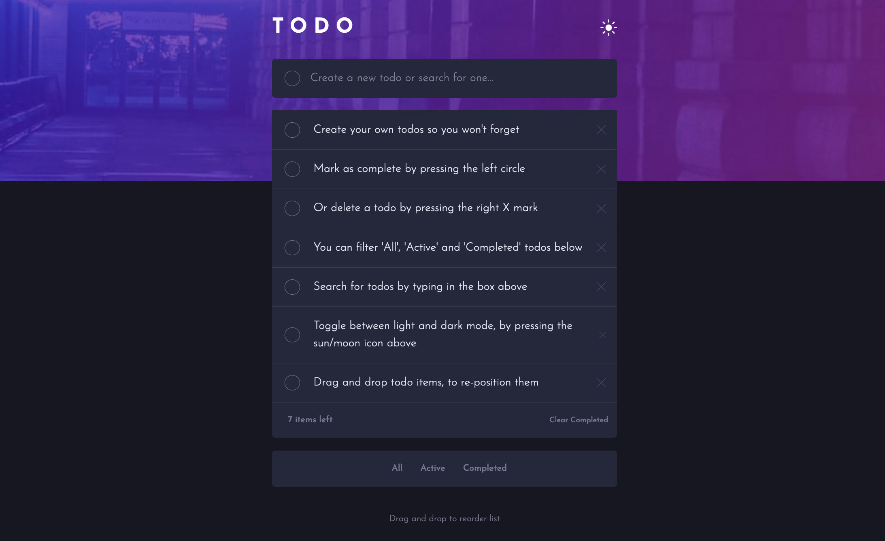

# Frontend Mentor - Todo app solution

This is a solution to the [Todo app challenge on Frontend Mentor](https://www.frontendmentor.io/challenges/todo-app-Su1_KokOW). Frontend Mentor challenges help you improve your coding skills by building realistic projects.

## Overview

This app half functional. I'm still trying to make it fully work.
It allows for you to create,search,delete, and filter your todos.

Unfortunately, the draggable feature breaks as soon as new todos are added. :(

### The challenge

Users should be able to:

- View the optimal layout for the app depending on their device's screen size
- See hover states for all interactive elements on the page
- Add new todos to the list
- Mark todos as complete
- Delete todos from the list
- Filter by all/active/complete todos
- Clear all completed todos
- Toggle light and dark mode
- **Bonus**: Drag and drop to reorder items on the list

### Screenshot

### Links

- Live Site URL: [Click Here](https://dank1368.github.io/todo__app/)

## My process

### Built with

- Semantic HTML5 markup
- SASS with partials
- Flexbox
- Mobile-first workflow
- vanilla JS

### What I learned

- Mobile-first approach to building the application

- I haven't really worked on projects that had a light/dark theme toggle. I'm still in the process learning the best way to separate the different styles. In this case, I created two separate folders containing the SASS files. One for dark, and the other for light theme. JS is used to update the href in link tag for the stylesheet to choose between the two themes. I'm not sure if that is a valid approach.

- I learned to create different functions to solve the problems of filtering the todos differently, based on the challenge.

- I also integrated a search function in the input field to filter todos based on the term entered by the user. This also let me practice more on chaining different array methods together. In this case the filter and forEach method.

- For the draggable feature, I followed [Web Dev Simplified](https://www.youtube.com/watch?v=jfYWwQrtzzY). It was my first time to integrate this feature, and learn how to program it. Unfortunately it seems to work only with the todos loaded on start. The code seems to break as soon as new todos are added. I'm still trying to find a solution for this to fix it.
